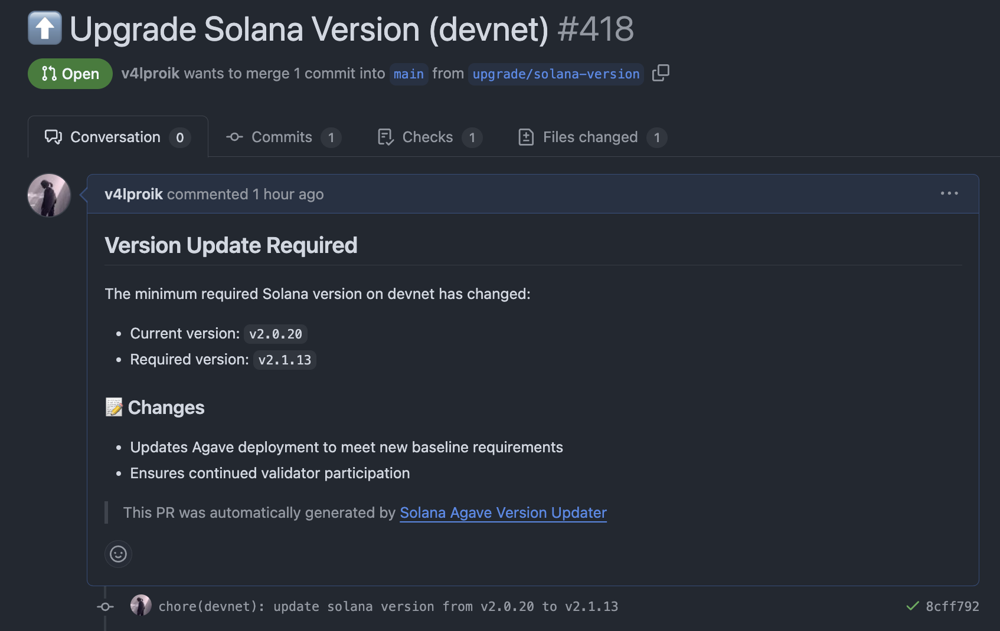

# Solana Agave Version Updater Action

A GitHub Action that automatically checks required Solana versions from network baseline requirements and updates your Agave validator deployment files. Keep your validators compliant across Mainnet, Testnet and Devnet by monitoring minimum required versions and automatically creating pull requests when updates are needed.

## 🌟 Features

- 🔍 Monitors official Solana baseline requirements across all networks
- 🔄 Updates Agave validator deployment YAMLs automatically
- 🤖 Creates descriptive PRs for version changes
- ⏰ Configurable schedules (default: daily)
- 🛡️ Maintains validator compliance effortlessly
- 📊 Clear version change logs and reporting

## 🚀 Quick Start

Basic usage with default settings (Testnet, daily checks):

```yaml
- uses: solforge-labs/solana-agave-version-updater@v0.1
  with:
    yaml-path: 'gitops/clusters/testnet/solana/agave-deployment.yml' # Path to Agave HelmRelease deployment YAML
    network: testnet
```

## ⚙️ Inputs

| Input | Description | Required | Default |
|-------|-------------|-----|---|
| `yaml-path` | Path to Agave deployment YAML | Yes | - |
| `network` | Target network (mainnet, testnet, devnet) | Yes | - |
| `python-version` | Python version for action runtime | No  | 3.11 |

## 📊 Outputs

| Name              | Description |
|-------------------|-------------|
| `min-version`     | New required Solana version |
| `current-version` | Current deployed version |
| `should-update`   | Boolean indicating if update needed |

## 📋 Example Workflow

Complete example with custom network and schedule:

```yaml
name: Monitor Solana Version
on:
  schedule:
    - cron: '0 0 * * *'  # Daily at midnight UTC
  workflow_dispatch:      # Manual trigger

permissions:
  contents: write
  pull-requests: write

env:
  yaml-path: gitops/clusters/devnet/solana/agave-1.yml
  network: devnet

jobs:
  check-version:
    runs-on: ubuntu-latest
    steps:
      - uses: actions/checkout@v4

      - name: Check Solana Version
        id: version-check
        uses: solforge-labs/solana-agave-version-updater@main
        with:
          yaml-path: ${{ env.yaml-path }}
          network: ${{ env.network }}

      - name: Create Pull Request
        if: steps.version-check.outputs.should-update == 'true'
        uses: peter-evans/create-pull-request@v5
        with:
          token: ${{ secrets.GITHUB_PAT }}
          commit-message: "chore(${{ env.network }}): update solana version from ${{ steps.version-check.outputs.current-version }} to ${{ steps.version-check.outputs.min-version }}"
          title: "⬆️ Upgrade Solana Agave Version (${{ env.network }})"
          body: |
            ## Version Update Required
             
            The minimum required Solana Agave version on ${{ env.network }} has changed:
            - Current version: `${{ steps.version-check.outputs.current-version }}`
            - Required version: `${{ steps.version-check.outputs.min-version }}`

            ### 📝 Changes
            - Updates Agave deployment to meet new baseline requirements
            - Ensures continued validator participation

            ### ⚠️ Important Note
            Before applying this update, please:
              - Review the release notes for any breaking changes
              - Verify that your validator arguments and configuration remain compatible
              - Test the update in a safe environment if possible
            
              This PR only bumps the version to meet network requirements. It's your responsibility to ensure compatibility with your specific setup.

            > This PR was automatically generated by [Solana Agave Version Updater](https://github.com/solforge-labs/solana-agave-version-updater)
          branch: upgrade/solana-version
          base: main
          delete-branch: true
```
## PR Creation


## 🔄 Network Support

Configure the action for different Solana networks:

```yaml
# Mainnet
- uses: solforge-labs/solana-agave-version-updater@v1
  with:
    yaml-path: gitops/mainnet/agave.yml
    network: mainnet

# Testnet
- uses: solforge-labs/solana-agave-version-updater@v1
  with:
    yaml-path: gitops/testnet/agave.yml
    network: testnet

# Devnet
- uses: solforge-labs/solana-agave-version-updater@v1
  with:
    yaml-path: gitops/devnet/agave.yml
    network: devnet
```

## 💡 Best Practices

1. **Schedule Frequency**: Daily checks are recommended to stay current with network requirements
2. **PR Reviews**: While automated, review PRs before merging to ensure smooth deployments
3. **Network Selection**: Use separate workflows for different networks to maintain clear versioning
4. **Monitoring**: Enable GitHub notifications for created PRs to stay informed
5. **Version Verification**: Cross-reference versions with official Solana announcements

## 🤝 Contributing

We welcome contributions! Here's how:

1. Fork the repo
2. Create your feature branch (`git checkout -b feature/amazing-feature`)
3. Make changes and test (`pytest`)
4. Commit changes (`git commit -m 'feat: add amazing feature'`)
5. Push to branch (`git push origin feature/amazing-feature`)
6. Open a Pull Request

## 📄 License

[MIT License](LICENSE)

## 🙋‍♂️ Support & Questions

- [Open an issue](https://github.com/solforge-labs/solana-agave-version-updater/issues/new)
- [GitHub Discussions](https://github.com/solforge-labs/solana-agave-version-updater/discussions)

---
Maintained with ❤️ by [Solforge Labs](https://github.com/solforge-labs)